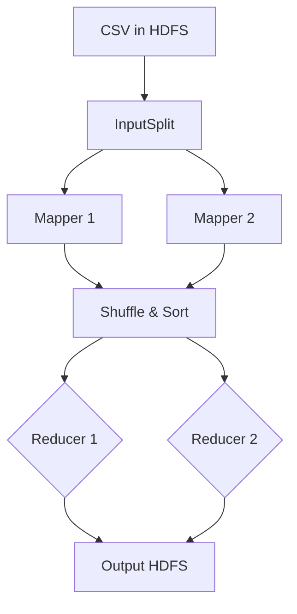

Primary objective- understand Amazon AWS (EC2). Understanding the services and interface. Two Hadoop MapReduce jobs are merged, analyzed and represented graphically. Application will be deployed on private cloud environment. Multiple layers of security. Google reCaptcha 2.0 and SSH.

<!--more-->


## Statistical representation of data using Hadoop MapReduce on AWS

### Learning and demonstrating Private Cloud

  As data continues to grow, now businesses have access to more data than ever before, which may go unused. This unused data can be grouped together using Hadoop MapReduce to provide business intelligence.

## Technology Stack

OS: Ubuntu 16
Programming: UNIX, shell script, JAVA, JSON, Bootstrap, JavaScript, Hadoop MapReduce, Html5, CSS.
Cloud Systems: Amazon AWS – EC2, Multimode cluster.
Other Functionality: Google reCAPTCHA 2.0, Google Charts

### AWS Cloud System Architecture


### AWS EC2 cluster (1-Master & 2 Slaves)


### Website with all charts and mined data from hadoop


## Technical Deep Dive: Divide and Conquer with MapReduce

Hadoop's MapReduce implements distributed computing through a simple abstraction: split work, shuffle, aggregate.

### MapReduce Flow



### Implementation

**Mapper:**
```java
public void map(LongWritable key, Text value, OutputCollector<Text, Text> output) {
    String[] rows = value.toString().split(",");
    String state = rows[10];  
    output.collect(new Text(state), new Text(demVotes + "\t" + repVotes));
}
```

**Reducer:**
```java
public void reduce(Text key, Iterator<Text> values, OutputCollector<Text, Text> output) {
    while(values.hasNext()){
        sum_dem += Integer.parseInt(tokens[0]);
    }
    output.collect(key, new Text(sum_dem + "\t" + sum_rep));
}
```

---

## Modern Approach (2026)

Big data processing has shifted from disk-based batch jobs to in-memory computation.

### The Spark Revolution

** MapReduce (2016):** Disk I/O bottleneck between stages.

**Apache Spark (2026):** In-memory processing:

```python
from pyspark.sql import SparkSession

df = spark.read.csv("s3://data/voting.csv", header=True)
result = df.groupBy("State").agg(
    sum("DemVotes"),
    sum("RepVotes")
).write.parquet("s3://output/")
```

100 lines of Java → 8 lines of Python. 10-100x faster execution.

### Serverless Analytics

**2016:** Manual cluster configuration.

**2026 Options:**

**AWS Athena:** Query S3 data with SQL:
```sql
SELECT state, SUM(dem_votes)
FROM s3_data
GROUP BY state
```

**EMR Serverless:** Submit jobs without managing infrastructure.

### Core Principles Endure

While implementation details changed, the fundamentals remain:
- Data locality (move computation to data)
- Fault tolerance (re-execute failed tasks)
- Partitioning (distribute work)

These underpin all modern frameworks: Spark, Flink, Beam.

---


Thank you!
