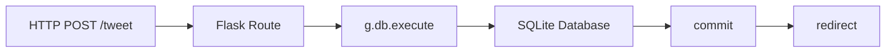

Minitwit application is example application that ships with the Flask microframework for Python. It implements a subset of Twitter’s functionality, allowing users to post new messages and follow messages posted by other users.<br />

<!--more-->


## Full-stack project - mini twitter application with RESTful API

New features added to MiniTwit

* **RESTful API** routes
* **Nginx** as reverse proxy and load balancer (Deployed on 3 servers)
* **SQLAlchemy** - The Python SQL Toolkit and Object Relational Mapper.
* **Flask-BasicAuth** - Authentication
* **MongoDB** - NoSQL document-oriented database
* **Redis** - Used for storing and retriving objects from cache
* **Tweet “Like” and “Unlike”** functionality
* **Leaderboard functionality** - most liked Twits will be on top.


<br /> 
<br />
<br /> 
<br />
<br />
### Implemented RESTful API for more than 10 paths with HTTP Authentication


<br />
<br />
## Technical Deep Dive: Flask Microframework Architecture

Flask represents the minimalist approach to web frameworks. Unlike Django's "batteries included" philosophy, Flask provides just the HTTP handling layer.

### Request Handling Flow



### Direct SQL Implementation

The application uses raw SQL for data operations:

```python
# From minitwit.py
cur = g.db.execute('select title, text from entries order by id desc')
entries = [dict(title=row[0], text=row[1]) for row in cur.fetchall()]
```

**Benefits:**  
Transparent database interactions, no hidden query generation.

**Drawbacks:**  
Requires manual connection management and parameterization to prevent SQL injection.

```python
# Safe parameterization
g.db.execute('insert into entries (title, text) values (?, ?)', [title, text])
```

---

## Modern Approach (2026)

The Python web development landscape has evolved significantly, particularly around async programming and type safety.

### ORM Adoption

**2017 Approach:** Manual SQL queries

**2026 Approach:** Type-safe ORMs

```python
# SQLModel (built on Pydantic)
from sqlmodel import Field, Session, SQLModel, select

class User(SQLModel, table=True):
    id: int | None = Field(default=None, primary_key=True)
    username: str
    email: str

# Type-safe query
statement = select(User).where(User.username == "akshay")
user = session.exec(statement).first()
```

**Benefits:**  
Automatic query generation, database-agnostic code, built-in migration support (Alembic), compile-time type checking.

### Async Web Frameworks

**Flask (Synchronous):**  
Each request blocks a thread.

**FastAPI/Quart (Asynchronous):**

```python
from fastapi import FastAPI

app = FastAPI()

@app.post("/tweet")
async def create_tweet(content: str):
    await db.execute("INSERT ...")  # Non-blocking I/O
    return {"status": "created"}
```

Async frameworks handle thousands of concurrent connections without thread pool exhaustion—critical for real-time applications like chat or social feeds.

### Modern Python Packaging

**2017:** `setup.py` and `requirements.txt`

**2026:** `pyproject.toml` with Poetry/Hatch:

```toml
[tool.poetry.dependencies]
python = "^3.11"
fastapi = "^0.108.0"
sqlmodel = "^0.0.14"
```

Deterministic dependency resolution prevents "works on my machine" issues.

---

GitHub: <https://github.com/thorveakshay/minitwit-python-app>

<br /> 

<br />
