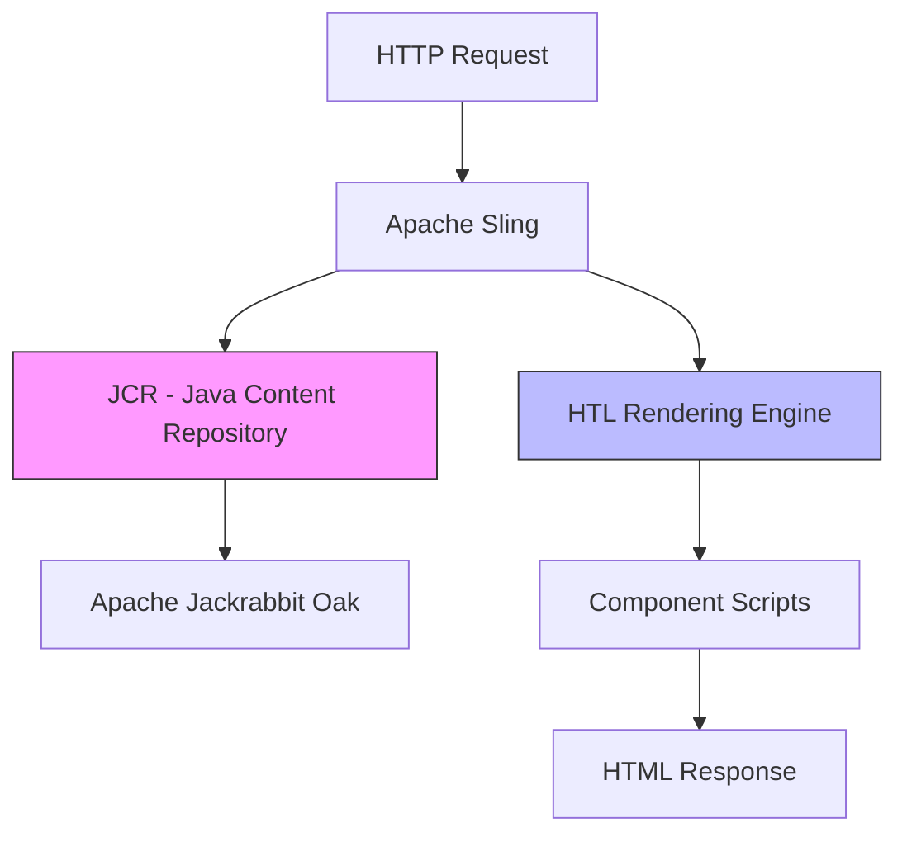

Creating demo website in AEM 6.3 to revise the AEM basic concepts

<!--more-->

## Adobe Experience Manager 6.3 website


### Prerequisites

What things you need to install the software and how to install them

```
AEM 6.0 +
```

### Snapshots


## Website UI


## Bracket Editor + AEM + Synchronization 


## CRXDE Lite Setup


## Technical Deep Dive: The AEM Content Management Stack

Adobe Experience Manager is built on an unconventional architecture that differs fundamentally from traditional MVC frameworks.

### AEM Architecture Layers



### Key Components

**Java Content Repository (JCR):**  
All content lives in a hierarchical tree of nodes instead of relational tables. A page, an image, and a configuration are all just nodes with properties:

```
/content/summit-toys/en/products/teddy-bear
  ├─ jcr:title = "Classic Teddy Bear"
  ├─ price = "29.99"
  └─ image → /content/dam/toys/teddy.jpg
```

**Apache Sling:**  
Maps URL paths to JCR nodes and executes the appropriate renderer.

**HTL (HTML Template Language):**  
Server-side templating with automatic XSS protection:

```html
<h1>${properties.title @ context='html'}</h1>
```

---

## Modern Approach (2026)

The AEM ecosystem has fundamentally shifted from monolithic installations to cloud-native, headless architectures.

### Headless CMS Revolution

**2018:** AEM as monolith handling content storage, logic, and HTML rendering.

**2026:** **Headless AEM** exposes content via GraphQL:

```graphql
query {
  productList {
    items {
      name
      price
      image
    }
  }
}
```

Frontend apps (Next.js, React) consume this content—fully decoupled.

### AEM as a Cloud Service

**2018:** Manual JAR installation, local Author/Publish instances.

**2026:** Adobe manages infrastructure:
- Auto-scaling based on traffic
- Continuous security updates
- Git-based deployment via Cloud Manager

### Component Model Evolution

AEM's drag-and-drop components (2018) foreshadowed modern patterns:
- **Then:** Sling components for marketers
- **Now:** React Server Components with similar composability

The core idea—empowering non-developers to build pages from pre-built blocks—remains central to modern Design Systems.

---

## Getting Started

These instructions will get you a copy of the project up and running on your local machine for development and testing purposes.

- Download this git source code as zip.
- Upload zip to http://localhost:4502/crx/packmgr/index.jsp packages
- Install the package
- Refresh your page.
- Navigate to localhost:4502/content/summit-toys/en.html


## Built With

- [AEM](https://www.adobe.com/marketing-cloud/experience-manager.html) - The web framework used


## Credits and Acknowledgments

- The code used in this demo website is based on code created by Adobe employee Dennis selfridge. Thank you Dennis!  
- Website: <https://helpx.adobe.com/experience-manager/using/first_aem63_website.html>
- Tutorial: <https://www.youtube.com/watch?v=RTtudQ-YSBw&t=7s>

