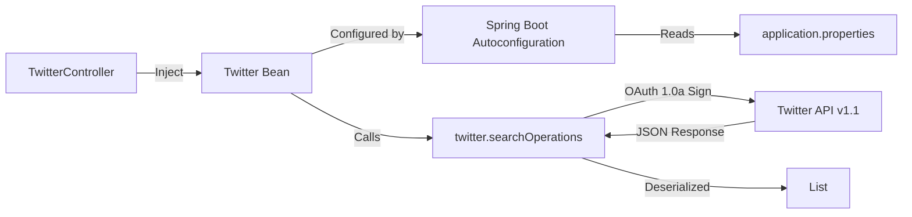

This is simple Spring Social Twitter Example to access twitter hashtag data.
I am using Java, Spring, Twitter API and REST API endpoint

<!--more-->

```java
// this is the code logic of application

@RestController
@RequestMapping(TwitterController.TWITTER_BASE_URI)
public class TwitterController {
	public static final String TWITTER_BASE_URI="tweets";

    @Autowired
    private Twitter twitter;

    @RequestMapping(value="{hashTag}", produces=MediaType.APPLICATION_JSON_UTF8_VALUE)
    public List<Tweet> getTweets(@PathVariable final String hashTag){
    	return twitter.searchOperations().search(hashTag, 25).getTweets();
    	//25 is the number of tweets, you can put whatever number you want.
    }

}
```

## Technical Deep Dive: Spring Social Abstraction Layer

This project demonstrates the convenience of abstraction libraries, specifically Spring Social's integration with Twitter API v1.1.

### Spring Social Architecture



### One-Line API Call

The library handled OAuth signing, HTTP transport, and JSON deserialization:

```java
@Autowired
private Twitter twitter;

public List<Tweet> getTweets(String hashTag){
    return twitter.searchOperations().search(hashTag, 25).getTweets();
}
```

Configuration was declarative:
```properties
spring.social.twitter.app-id=YOUR_CONSUMER_KEY
spring.social.twitter.app-secret=YOUR_CONSUMER_SECRET
```

---

## Modern Approach (2026)

This implementation highlights the risks of depending on abstraction libraries that tightly couple to third-party APIs.

### The End-of-Life Lesson

Spring Social reached EOL in 2018. When Twitter deprecated API v1.1 in favor of v2, applications using this library faced a painful migration—not just updating API calls, but replacing the entire dependency.

**Key Lesson:** Abstraction libraries reduce boilerplate but create vendor lock-in. Evaluate the trade-off carefully.

### How This Would Be Built Today

**HTTP Client:**  
Use **Spring WebClient** (reactive) or **RestClient** (blocking, Spring Boot 3.2+) instead of library wrappers:

```java
WebClient client = WebClient.builder()
    .baseUrl("https://api.twitter.com/2")
    .defaultHeader("Authorization", "Bearer " + bearerToken)
    .build();

List<Tweet> tweets = client.get()
    .uri("/tweets/search/recent?query=%23{hashtag}", hashtag)
    .retrieve()
    .bodyToMono(new ParameterizedTypeReference<List<Tweet>>() {})
    .block();
```

**Resilience Patterns:**  
The original implementation had no rate-limit handling. Modern applications use **Resilience4j**:

```java
@CircuitBreaker(name = "twitter", fallbackMethod = "getCachedTweets")
public List<Tweet> search(String hashtag) {
    // API call
}

public List<Tweet> getCachedTweets(String hashtag, Exception e) {
    return cacheService.get(hashtag); // Fallback to cached data
}
```

### What Worked Well

Despite the EOL risk, this project successfully demonstrated OAuth flows and third-party integrations—concepts that remain relevant regardless of technology choices.

---

## GitHub
Code is available on below link.
GitHub: <https://github.com/thorveakshay/access-twitter-hashtag-data-using-spring>

## Deployment

-   Clone this github repo
-   Imprt project to eclipse as existing maven project
-   Change app-id and app-secret in application.properties
-   Go to project directory and run below command


    mvn spring-boot:run

## Deployment

 Steps:

-   Go to Spring Stater `https://start.spring.io/`
-   Select spring version Spring Boot
-   Fill the Project Metadata
-   Click on Switch to the full version link below generate project button.
-   Select web and Twitter dependancy
-   Generate project
-   Import downloaded zip as a maven project in eclipse
-   Create developer app on twitter and put your details in applications.properties

```properties
spring.social.twitter.app-id=
spring.social.twitter.app-secret=
```

Hit below url

    http://localhost:8080/tweets/%23manutd

    Note: %23 is #(hash)

you will get latest 25 tweets for that hashtag

-   You can replace manutd with any other hashtag of your choice in browser

## Output

Below are snapshot. Do whatever you want to achieve with this data.

### For manutd hashtag

### For manutd hashtag


### For smile hashtag


