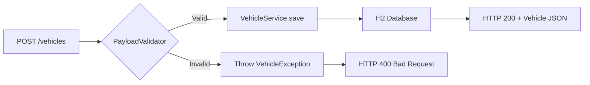

Implementing sample CRUD application in Spring boot and H2 database. Demonstrating RESTful client server communication, Unit testing, server-side validations and standard coding practices. 

<!--more-->
  

# Smart Vehicle System

## Functionality covered

All RESTful endpoints working. Tested using Postman


```text
GET vehicles
GET vehicles/{id}
POST vehicles
PUT vehicles
DELETE vehicles/{id}
```
* Implemented validation to service.
    - Vehicles must have a non-null / non-empty make and model specified, and the year must be
    between 1950 and 2050.

## Technology Stack

1. Java
2. Maven
3. Spring
4. Spring-Boot
5. JUnit
6. MockMvc Unit Test framework
7. H2 in-memory persistence


## Steps to Setup

### Direct URL
##### I deployed webservice on Heroku(Cloud Service) with internal git CI/CD.
Service URL: https://smart-vehicle.herokuapp.com/

### Code Setup

1. **Get the code repo**

2. **Build and run the backend app using maven**

```bash
cd smart-vehicle-system
mvn package
java -jar target/smart-vehicle-system-1.0.jar
```

Alternatively, you can run the app without packaging it using

```bash
cd smart-vehicle-system
mvn spring-boot:run
```

The backend localhost service will start at <http://localhost:8080>.


Endpoints:
```text
localhost
http://localhost:8080/vehicles
http://localhost:8080/vehicles/1

cloud service
https://smart-vehicle.herokuapp.com/vehicles
https://smart-vehicle.herokuapp.com/vehicles/1
```

Try below on postman:

POST request on --> http://localhost:8080/vehicles

```json
{
//use below JSON data object
// ID is autogenerated

        "Year": 2000,
        "Make": "Ford",
        "Model": "Mustang"
    }
```


PUT request on ---> http://localhost:8080/vehicles
```json
{
//use below JSON data object

	"Id": 5,
        "Year": 2018,
        "Make": "Ford",
        "Model": "Mustang 2018"
    }
```

DELETE request on --> http://localhost:8080/vehicles/4


## Unit test Coverage
100% classes covered, 78% lines covered.

## Snapshots

### GET one request


### GET Request


### DELETE Request


### POST Request


### PUT Request


### Test Client


### High Level Unit Test Coverage


### Unit Test coverage


### Unit Test Result


## Technical Deep Dive: Application-Layer Validation

This REST API implements a key principle: validate early, fail fast. The `PayloadValidator` class enforces business rules before database interaction.

### Validation Architecture



### Business Rule Implementation

The validator enforces constraints that go beyond database-level checks:

```java
// From PayloadValidator.java
public static boolean validateCreatePayload(Vehicle vehicle) {
    if (vehicle.getId() > 0) {
        return false; // ID should be auto-generated, not client-provided
    }
    
    // Domain rule: Support vehicles from 1950-2050
    if (vehicle.getYear() < 1950 || vehicle.getYear() > 2050) {
        return false;
    }
    return true;
}
```

This separation keeps domain logic out of the controller, making it reusable across different entry points (REST, GraphQL, batch jobs).

---

## Modern Approach (2026)

The validation strategy used here was standard for 2018. Today's Spring ecosystem offers more declarative alternatives.

### Constructor Injection over Field Injection

**2018 Pattern:**
```java
@Autowired
private VehicleService service;
```

**2026 Pattern:**
```java
private final VehicleService service;

public VehicleController(VehicleService service) {
    this.service = service;
}
```

**Why It Matters:**  
Constructor injection makes dependencies explicit and enables instantiation without Spring for unit testing. The `final` keyword guarantees immutability.

### Bean Validation (JSR-380) over Custom Validators

The manual validation class can be replaced with annotations:

```java
public class Vehicle {
    @Min(1950) @Max(2050)
    private int year;
    
    @NotBlank
    private String make;
}
```

In the controller:
```java
@PostMapping("/vehicles")
public ResponseEntity<Vehicle> create(@Valid @RequestBody Vehicle vehicle) {
    // Validation happens automatically before method execution
    return ResponseEntity.ok(service.save(vehicle));
}
```

Violations automatically return HTTP 400 with detailed error messages—no exception handling boilerplate needed.

### OpenAPI Documentation

Rather than maintaining endpoint lists in documentation, modern Spring applications generate it:

```xml
<dependency>
    <groupId>org.springdoc</groupId>
    <artifactId>springdoc-openapi-starter-webmvc-ui</artifactId>
</dependency>
```

This provides a Swagger UI at `/swagger-ui.html` for interactive API exploration.

### Core Principle Endures

The foundational lesson—validate at the application boundary—remains critical. Never trust client input. The implementation details (manual vs. declarative) may evolve, but the security mindset does not.

---

## GitHub
Code is available on below link.
https://github.com/thorveakshay/smart-vehicle-system

Feel free to use the code.
