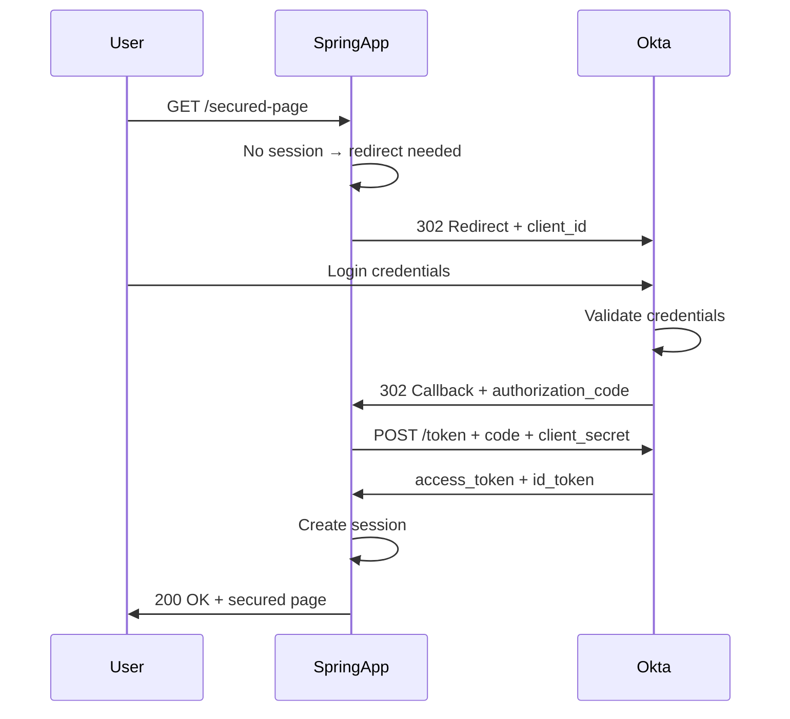

Simple Okta OAuth 2 authentication application with Login and Logout. This app can be intigrated with any Java, Spring or backend framework. You can extend this as per your needs.

<!--more-->
  

## Spring Boot, OAuth2 Authentication, Okta API


## Requirements

1. Java - 1.8.x
2. Maven - 3.x.x
3. Spring 5, Spring Boot
4. Okta developer App

## Steps to Setup

1. **Clone the application repo**

2. **Change application.yml file**  
   Change file with your clientId and clientSecret.

3. **Build and run the backend app using maven**

```bash
mvn spring-boot:run
```
The application will start at <http://localhost:8080>.

## Snapshots

### Landing page


### API authentication on Okta


### Callback to base URL after successful authentication


### Code

Controller `WelcomeController.java` 

```java
@Configuration
@EnableAutoConfiguration
@Controller
public class WelcomeController {

	@RequestMapping("/")
	public String welcomeSurvey(OAuth2Authentication authentication) {

		if (authentication != null) {

			LinkedHashMap<String, Object> properties = (LinkedHashMap<String, Object>) authentication
					.getUserAuthentication().getDetails();
			System.out.println("===========================================");
			System.out.println("Authentication Object is: " + properties);
			System.out.println("User name is: " + properties.get("name"));
			
		}

		return "index";
	}

	// test 5xx errors
	@RequestMapping("/5xx")
	public String ServiceUnavailable() {
		throw new RuntimeException("ABC");
	}

}
```

Rest Controller `SpringBootWebApplication.java`  with EnableOAuth2Sso

```java
@EnableOAuth2Sso
@RestController
@SpringBootApplication
public class SpringBootWebApplication extends WebSecurityConfigurerAdapter {


	@Override
    protected void configure(HttpSecurity http) throws Exception {

		http
		.csrf().disable()
		.authorizeRequests()

		.antMatchers("/api/**", "/dashboard", "/welcome").authenticated()
        .antMatchers("/**").permitAll()
        .anyRequest().authenticated()
        .and().logout().logoutSuccessUrl("/").permitAll();

  }
	  @RequestMapping("/user")
	  public Principal user(Principal principal) {

	      return principal;
	  }

	  @RequestMapping("/akshay")
	    public void user(OAuth2Authentication authentication) {
	        LinkedHashMap<String, Object> properties = (LinkedHashMap<String, Object>) authentication.getUserAuthentication().getDetails();

System.out.println("Authentication Object is: "+ properties);
	        System.out.println("User name is: "+ properties.get("name"));
	        System.out.println("User ID is: "+ properties.get("id"));


	    }

	public static void main(String[] args) throws Exception {
		SpringApplication.run(SpringBootWebApplication.class, args);
	}

}
```

## Technical Deep Dive: Understanding OAuth2 Single Sign-On

The `@EnableOAuth2Sso` annotation in Spring Boot 1.x abstracted the complexity of the OAuth2 authorization code flow into a single configuration point.

### OAuth2 Flow Diagram



### Authentication Object Handling

The controller received user details through the `OAuth2Authentication` object. The implementation used type casting to extract attributes:

```java
@RequestMapping("/")
public String welcome(OAuth2Authentication authentication) {
    LinkedHashMap<String, Object> properties = 
        (LinkedHashMap<String, Object>) authentication.getUserAuthentication().getDetails();
    
    String userName = (String) properties.get("name");
    // Direct map access - no type safety, but straightforward
}
```

This approach worked but relied on runtime type casting and knowledge of the provider's claim structure.

---

## Modern Approach (2026)

The OAuth2 landscape has matured significantly. Spring Security now emphasizes explicitness and type safety over convention-based shortcuts.

### Migration from `@EnableOAuth2Sso` to Modern Spring Security

**2018 Approach:**  
Single annotation handled everything—convenient but opaque.

**2026 Approach:**  
Explicit bean configuration using lambda DSL:

```java
@Bean
public SecurityFilterChain filterChain(HttpSecurity http) throws Exception {
    http
        .authorizeHttpRequests(authz -> authz
            .requestMatchers("/", "/login**").permitAll()
            .anyRequest().authenticated()
        )
        .oauth2Login(withDefaults());
    return http.build();
}
```

This declarative style makes security rules auditable at a glance—critical for compliance reviews.

### Type Safety Improvements

Instead of casting to `LinkedHashMap`, modern controllers use strongly-typed principals:

```java
@GetMapping("/user")
public String user(@AuthenticationPrincipal OidcUser principal) {
    String email = principal.getEmail(); // Type-safe, IDE-friendly
    String name = principal.getGivenName();
    return "welcome";
}
```

### Security Hardening

**Secrets Management:**  
The original `application.yml` stored client secrets in plaintext. Production systems now mandate:
- **Kubernetes Secrets** for containerized deployments
- **HashiCorp Vault** for dynamic credential rotation
- **Environment variables** as a minimum baseline

**PKCE Support:**  
Proof Key for Code Exchange is now standard for public clients, preventing authorization code interception attacks.

### What Remains Constant

The redirect flow (Authorization Code Grant) remains the gold standard for web applications. The fundamental security principle—never expose client secrets to browsers—hasn't changed. Only the implementation details have improved.

---

Feel free to use the code.
