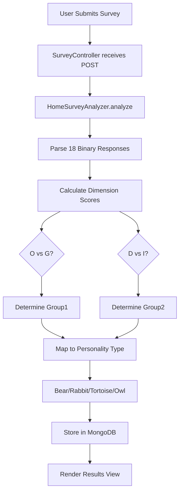

Predict Yourself - Behavioral Tracking application
(Know your self and know how to communicate with other personalities)
Java, RESTful Maven, MongoDB, Spring 5, Spring Boot, Mustache Templating, HTML, CSS and JS
OAuth2, Spring Security, Okta, Facebook Social login.

<!--more-->


# Real Me (iAm)
## Spring Boot, MongoDB, Mustache (Template system)

What is Real Me (iAm)? Motivation...

- We already achieved goal of Web 1.0 i.e. connect the all population together using Internet, social media, web pages, forums etc.
- we are working on Web 2.0 to achieve its goal of connecting all devices together using The Internet of things (IoT), Artificial Intelligence (AI), machine learning etc.
- We are more interested in other people’s lives. Facebook, Instagram, Snapchat..
- we got one life its always beneficial to look in our life, analyze it, improve it, find ways which suites our personality

## Proposed system design and architecture
The first question is how to do behavior analytics?
There are three basic steps.
1. Gather behavioral data
2. Process data
3. Show results or Insights
 
## Technologies

1. Java - 1.8.x
2. Maven - 3.x.x
3. MongoDB - 3.x.x
4. Spring 5, Spring Boot
5. Mustache - 0.9.0

## Steps to Setup

1. **Clone the application repo**
2. **Build and run the backend app using maven**

```bash
cd spring-boot-backend
mvn package
java -jar target/build-1.0.0.jar
```

Alternatively, you can run the app without packaging it using

```bash
mvn spring-boot:run
```

The backend server will start at <http://localhost:8080>.


## Output

Deployed on: <https://iam-app.herokuapp.com/>

MongoDB(some features) is not working as I am using free version of Heroku.

## Snapshots

### Home Page of Website


### Navigation


### In-house Algorithm in JAVA Spring-Boot


### OAuth2 Authentication of the user using Okta API


### Running app using maven


### Home page


### Profile page


### Survey website and Questions


### Project Structure


### Mongo Storage


## End Results – User Insights
### Behavioral tagging
Above data processing algorithm will give me insights about the user behavior and, I am tagging them to one of the below behavior
```text
Tortoise - Supporter/Relater
Owl - Analyzer/Thinker
Rabbit - Promoter/Socializer
Bear - Controller/Director
```
### Displaying Twitter feeds based on user inputs
Relevant Tweets / News Feed


## Source Code
Github: https://github.com/thorveakshay/iAm-Behavioral-Analytics-Application-Spring-Boot

---

## Technical Deep Dive: The Personality Classification Engine

The application implements a behavioral classification algorithm in `HomeSurveyAnalyzer.java` that categorizes users based on survey responses.

### Architecture Flow



### The Scoring Implementation

The system tracks four behavioral dimensions across 18 questions:
- **O vs G** (Open vs Guarded communication style)
- **D vs I** (Direct vs Indirect decision-making)

Each response increments one of the counters:

```java
// Core logic from HomeSurveyAnalyzer.java
if (obj.getString("question1").equals("1")) O++; else G++;
if (obj.getString("question2").equals("1")) I++; else D++;
// Repeated for all 18 questions

String group1 = O > G ? "O" : "G";
String group2 = D > I ? "D" : "I";

if ("G".equals(group1) && "D".equals(group2)) {
    iAm = "Controller/Director"; // Bear personality
} else if ("O".equals(group1) && "D".equals(group2)) {
    iAm = "Promoter/Socializer"; // Rabbit personality  
}
// Additional conditionals handle Tortoise and Owl types
```

The algorithm deterministically maps each combination to one of four personality archetypes.

---

## Modern Approach (2026)

Reviewing this implementation with my current experience, I see several opportunities for architectural improvement while acknowledging what worked well.

### What Would Change

**Rule Engine over Hardcoded Logic**  
The 18-question if/else block served its purpose but creates maintenance burden. Today I would use a **Strategy Pattern** or externalize the rules to a JSON configuration. This allows questionnaire updates without code deployments—critical for A/B testing different personality frameworks.

**Technology Stack Evolution**  
- **2018 Stack:** Spring Boot 1.5.11, Java 8, Mustache server-side rendering  
- **2026 Stack:** Spring Boot 3.x with Java 21 virtual threads, React frontend consuming a stateless API  
- **Why:** Decoupling the UI enables mobile apps and third-party integrations. Virtual threads handle concurrent surveys without thread pool exhaustion.

**Infrastructure Modernization**  
The original Heroku deployment was pragmatic but limiting. Current approach:
- **Containerization:** Dockerfile + kubernetes manifests for portable deployments
- **Serverless Option:** AWS Lambda for the scoring endpoint—pay per survey submitted, not per hour of uptime
- **Database:** MongoDB Atlas replaces self-managed instances, with automatic scaling

### What Remains Valuable

The core MVC separation and OAuth2 integration patterns established here are still foundational. The questionnaire-based data collection approach scales well—Netflix and Spotify use similar preference engines at massive scale.

The MongoDB document model was the right choice. Storing each user's complete response object without schema migrations remains a key advantage for behavioral data that evolves over time.

---

Thank you!
