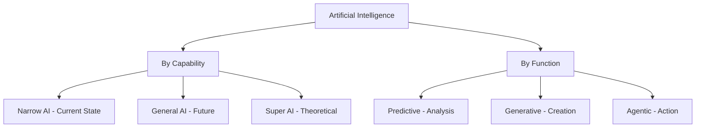
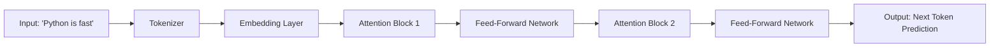
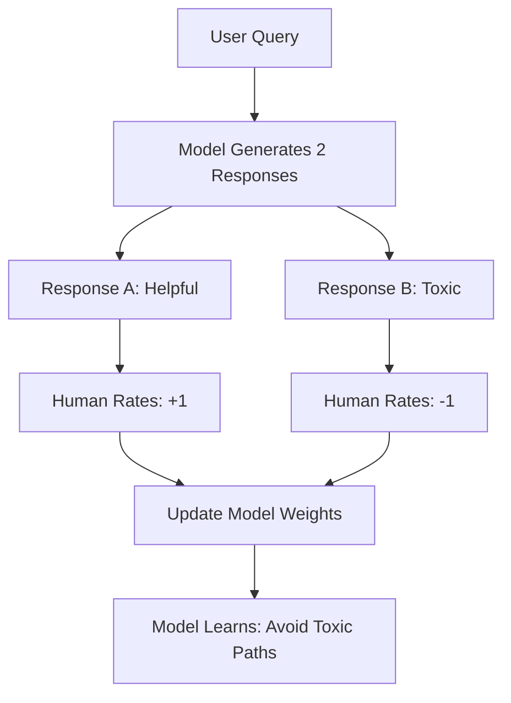
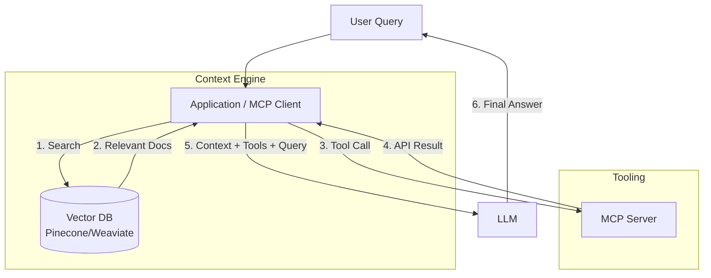
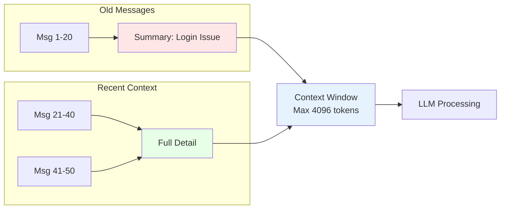
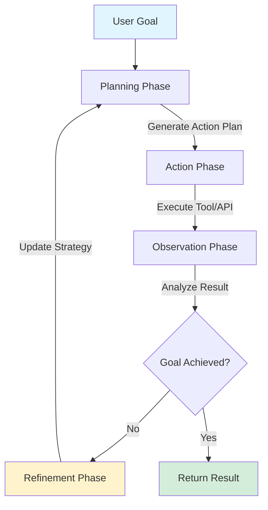
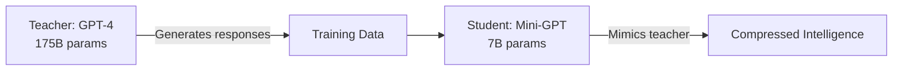

Artificial Intelligence has transformed from a futuristic concept into an engineering necessity. However, communicating effectively about AI requires navigating a dense forest of terminology.

In this guide, we bridge the gap. We start with the high-level landscape of intelligence types, then drill down into the deep mechanical terms—like **Tokens**, **Vectors**, and **Transformers**—that every engineer needs to know to build modern applications.

<!--more-->

## Part 1: The Landscape of Intelligence

Before diving into the mechanics, we must establish a shared vocabulary for the *types* of systems we are building.

### The Spectrum of Capability
It is crucial to distinguish between what exists today and what is theoretical.
*   **ANI (Artificial Narrow Intelligence):** AI specialized for a single task. This encompasses **all current AI**, from a Chess engine to Claude or GPT-4o. They excel in their domain but lack general consciousness.
*   **AGI (Artificial General Intelligence):** A hypothetical system capable of learning and solving *any* intellectual task a human can. It transfers knowledge across domains intuitively.
*   **ASI (Artificial Super Intelligence):** An intellect that vastly surpasses the best human brains in every field, including creativity and wisdom.

### The Functional Evolution
We can also categorize AI by what it *does*:
1.  **Predictive AI:** The "traditional" stack. It analyzes past data to forecast future outcomes (e.g., Credit Scores, Fraud Detection, Netflix Recommendations).
2.  **Generative AI:** The current wave. It creates *new* content (Text, Images, Code) by learning patterns from massive datasets.
3.  **Agentic AI:** The next frontier. Systems that do not just generate text but execute *actions* to complete complex workflows.



---

## Part 2: The Core Engine (Mechanics)

How does a Generative AI model actually work? It is not magic; it is math.

### 1. Large Language Model (LLM)
An LLM is a probabilistic engine, not a knowledge base. It is a neural network trained to predict the **next token** in a sequence.

**Example:**
```
Input:  "The weather today is"
Model predicts:
  - "sunny" (45% probability)
  - "cloudy" (30% probability)
  - "rainy" (15% probability)
  - "purple" (0.001% probability)
```

The model doesn't "know" the weather; it calculates what word statistically follows based on millions of similar sentences it has seen during training.

### 2. Tokenization
Computers cannot read "English". They process numbers. **Tokenization** breaks text into discrete numerical units.

**Example:**
```
Text:      "Running quickly"
Tokens:    ["Run", "ning", " quick", "ly"]
Token IDs: [4402, 1076, 2068, 398]
```

**Why sub-word tokenization?**
- "running", "runner", "runs" all share the root "run"
- The model learns that the suffix "-ing" indicates present continuous tense
- Common words like "the" are single tokens; rare words like "antidisestablishmentarianism" are split into multiple tokens

### 3. Vectors (The Meaning Map)
Tokens are just identifiers. **Vectors** represent *meaning*.

**Definition:** A vector is an N-dimensional coordinate (e.g., `[0.12, -0.98, 0.45, ...]` in 768 or 1536 dimensions).

**The Magic of Embeddings:**
```
Vector("King")   ≈ [0.5, 0.8, -0.3, ...]
Vector("Queen")  ≈ [0.52, 0.79, -0.28, ...]  // Close to King
Vector("Python") ≈ [-0.6, 0.1, 0.9, ...]     // Far from King
```

**Practical Application:**
```python
# Real-world usage with OpenAI
from openai import OpenAI
client = OpenAI()

response = client.embeddings.create(
    model="text-embedding-3-small",
    input="Machine learning is fascinating"
)

vector = response.data[0].embedding  # Returns 1536-dim array
```

### 4. Attention (The 2017 Breakthrough)
How do we handle ambiguity?

**The Problem:** Consider the word **"Python"**.
*   *Context A:* "The **Python** slithered through the grass." (Snake)
*   *Context B:* "I love coding in **Python**." (Programming language)

**The Solution:** The **Attention Mechanism** looks at the surrounding words:
- When it sees "slithered" and "grass" → pushes Vector(Python) closer to Vector(Snake)
- When it sees "coding" and "language" → pushes Vector(Python) closer to Vector(Programming)

**Mathematical Intuition:**
```
Attention Score = Query · Key / √(dimension)

If Query="Python" and Key="slithered":
  Score is HIGH → Strong influence
  
If Query="Python" and Key="democracy":
  Score is LOW → Weak influence
```

### 5. Transformer
The **Transformer** is the specific architecture that implements this Attention mechanism. It processes input tokens in parallel (unlike older RNNs), enabling us to train on massive datasets like the entire internet.

**Architecture Flow:**


**Real Implementation Note:** GPT-4o (2024) has ~100 such layers stacked. GPT-5 (early 2026) reportedly has 150+ layers. Each layer refines understanding: Layer 1 handles syntax, Layer 50 understands sarcasm, Layer 100+ can detect subtle implications.

---

## Part 3: How Models Learn (Training)

### 6. Self-Supervised Learning
We teach children by showing them the world, not by rewriting dictionary rules. AI training is similar.

**Method:** We mask words in a sentence:
```
Original:  "The cat sat on the mat"
Masked:    "The cat [MASK] on the mat"
Model prediction: "sat" ✓
```

**Why This is Revolutionary:**
- No humans needed to label data
- We can use ALL text on the internet (Wikipedia, GitHub, Reddit, books)
- Training on trillions of words becomes feasible

### 7. Fine-Tuning
A general practitioner knows medicine broadly, but a cardiologist knows the heart deeply.

**Base Model → Fine-Tuned Model:**
```
Base:       GPT-4 (knows general English)
            ↓ Train on 10,000 legal documents
Fine-Tuned: GPT-4-Legal (speaks like a lawyer)
```

**Practical Example:**
```python
# Using Hugging Face for fine-tuning
from transformers import AutoModelForCausalLM, Trainer

model = AutoModelForCausalLM.from_pretrained("gpt2")
trainer = Trainer(model=model, train_dataset=legal_docs)
trainer.train()  # Now specialized for legal text
```

### 8. Reinforcement Learning (RL)
How do we ensure the model is helpful and safe?

**The RLHF (Reinforcement Learning from Human Feedback) Process:**


**Real-World Impact:** This is why ChatGPT, Claude, and Gemini refuse harmful requests and maintain safety guardrails, unlike the raw base models they were trained from.

---

## Part 4: Modern Patterns (Context & Architecture)

As engineers, we build **around** the model. This is where the industry is innovating most rapidly.

### 9. Few-Shot Prompting
Before RAG, there was a simpler technique: teaching by example.

**Zero-Shot (No Examples):**
```
Prompt: "Translate to French: Hello"
Output: "Bonjour"
```

**Few-Shot (With Examples):**
```
Prompt: 
English: Hello → French: Bonjour
English: Goodbye → French: Au revoir
English: Thank you → French: ?

Output: "Merci"
```

**Real-World Use Case:**
```python
# Sentiment classification with examples
prompt = """
Classify the sentiment:

Text: "This product is amazing!" → Positive
Text: "Worst purchase ever" → Negative
Text: "It's okay I guess" → Neutral
Text: "Absolutely love the design!" → ?
"""

response = llm.generate(prompt)  # "Positive"
```

**Why it works:** The model pattern-matches from the examples, improving accuracy without fine-tuning.

### 10. RAG (Retrieval Augmented Generation)
LLMs hallucinate and contain outdated data. **RAG** fixes this.

**Example Scenario:**
```
User: "What is our remote work policy for 2026?"

Without RAG:
 LLM: "I don't have access to your company's specific policies."

With RAG:
 1. System searches company Wiki for "remote work policy"
 2. Finds: "employees_handbook.pdf - Updated Jan 2026"
 3. Inserts that document into the prompt
 4. LLM: "According to your 2026 policy, employees can work 
          remotely 3 days/week with manager approval."
```

**Technical Implementation:**
```python
# Simplified RAG pipeline
def answer_question(question):
    # 1. Retrieve
    docs = vector_db.similarity_search(question, k=3)
    
    # 2. Augment
    context = "\n".join([doc.content for doc in docs])
    prompt = f"Context: {context}\n\nQuestion: {question}"
    
    # 3. Generate
    response = llm.generate(prompt)
    return response
```

### 10. Vector Databases
To make RAG work, we need to find the right document.

**Semantic Search vs Keyword Search:**
```
Query: "system crashed"

Keyword Search finds:
  - Documents with exact words "system" and "crashed"

Vector Search finds:
  - "application failure" (semantically similar)
  - "server downtime" (related concept)
  - "outage incident" (different words, same meaning)
```

**Popular Vector Databases:**
- **Pinecone:** Managed, serverless
- **Weaviate:** Open-source, GraphQL API
- **Chroma:** Embedded, great for prototypes

**Example Usage:**
```python
import chromadb

client = chromadb.Client()
collection = client.create_collection("docs")

# Store documents
collection.add(
    documents=["Python is great for ML", "JavaScript for web"],
    ids=["doc1", "doc2"]
)

# Search
results = collection.query(
    query_texts=["machine learning tools"],
    n_results=2
)
# Returns: "Python is great for ML" (high similarity)
```

### 11. Model Context Protocol (MCP)
This is the standard for connecting AI to the real world.

**Client/Server Architecture:**
```
[User] → [App/MCP Client] → [LLM]
                ↓
          [MCP Server 1: Database]
          [MCP Server 2: API]
          [MCP Server 3: File System]
```

**Real-World Example:**
```
User: "Email John the Q4 sales report"

1. LLM realizes it needs tools
2. MCP Client connects to:
   - File System Server (to find "Q4_sales.pdf")
   - Email Server (to send via Gmail API)
3. LLM instructs:
   - get_file("Q4_sales.pdf")
   - send_email(to="john@company.com", attachment=file)
4. User receives confirmation
```



### 12. Context Engineering
Managing what the LLM "remembers" is critical.

**The Challenge:**
- LLMs have context windows (e.g., GPT-4o: 128k tokens, Claude 3.5: 200k tokens, Gemini 1.5 Pro: 2M tokens)
- A long conversation can exceed this limit

**Strategies:**
```
Sliding Window:
  [Msg 1] [Msg 2] [Msg 3] ... [Msg 100] [Msg 101]
  Keep latest 50 messages, summarize older ones

Summarization:
  Messages 1-50: "User was troubleshooting a login issue."
  Messages 51-100: [Full detail]

Semantic Compression:
  Only keep messages relevant to current topic
```

**Context Window Management:**


---

## Part 5: The Frontier (Agents & Optimization)

### 13. Agents
If Generative AI is a "writer", Agentic AI is a "worker".

**Example Agent Workflow:**
```
Goal: "Book a flight to NYC next week under $400"

Agent Loop:
1. PLAN:    Check calendar → Search flights → Compare prices → Book
2. ACT:     Calls Google Calendar API → Gets free dates
3. OBSERVE: User is free Thu-Sun
4. ACT:     Searches Kayak for Thu flights < $400
5. OBSERVE: Found 3 options
6. ACT:     Books cheapest flight
7. REFINE:  Confirms booking, adds to calendar
```

**Code Example (Simplified):**
```python
class TravelAgent:
    def book_flight(self, goal):
        while not goal_achieved:
            plan = self.llm.generate_plan(current_state)
            action = self.select_action(plan)
            result = self.execute_tool(action)
            
            if result.success:
                self.update_state(result)
            else:
                self.replan()
```

**Agent Loop Visualization:**


### 14. Chain of Thought (Reasoning)
Standard models guess quickly. Reasoning models (like OpenAI o1, o3, and DeepSeek R1) "think" first.

**Standard LLM:**
```
Q: "If 5 machines make 5 widgets in 5 minutes, how long 
    for 100 machines to make 100 widgets?"
A: "500 minutes" ✗ (Wrong - guessed too fast)
```

**Chain of Thought LLM:**
```
Q: [same]
Internal reasoning:
  1. 5 machines → 5 widgets in 5 min
  2. So 1 machine → 1 widget in 5 min
  3. 100 machines can work in parallel
  4. Each makes 1 widget in 5 min
  5. Answer: 5 minutes
A: "5 minutes" ✓
```

### 15. Multimodal Models
Text is just one mode of data. Multimodal models handle Images, Video, and Audio as first-class citizens.

**Capabilities:**
```
Input: [Image of a bug in code screenshot]
Output: "Line 23 has a typo: 'lenght' should be 'length'"

Input: [Video of cooking]
Output: "Recipe: 1. Dice onions 2. Sauté for 3min 3. Add tomatoes..."

Input: [Audio of customer complaint]
Output: "Customer is upset about delayed shipping. Sentiment: Negative"
```

**Practical Implementation with GPT-4o Vision:**
```python
from openai import OpenAI
client = OpenAI()

response = client.chat.completions.create(
    model="gpt-4-vision-preview",
    messages=[
        {
            "role": "user",
            "content": [
                {"type": "text", "text": "What's in this image?"},
                {
                    "type": "image_url",
                    "image_url": {"url": "https://example.com/chart.png"}
                }
            ]
        }
    ]
)

print(response.choices[0].message.content)
# "This is a bar chart showing Q4 sales data with revenue increasing 23%"
```

**Why Multimodal Training is Superior:**
- Models trained on both text + images understand concepts better
- "A picture is worth a thousand words" → More training signal per example
- Cross-modal understanding: Can describe images in text, generate images from text

### 16. Small Language Models (SLMs) & Optimization
We are moving from "Bigger is Better" to "Smarter is Efficient".

**The Size Revolution:**
```
2020: GPT-3 (175B parameters) - Cloud only
2023: Llama 2 (70B parameters) - Requires GPU server
2025: Llama 3.1 (8B parameters) - Runs on MacBook Pro
2026: Phi-4 (14B parameters) - Runs on iPhone 16 Pro
       Gemma 2 (2B parameters) - Edge devices
```

**Distillation Process:**


**Quantization Example:**
```
Original Model: 13GB (32-bit floats)
            ↓ Apply 8-bit quantization
Quantized:  3.25GB (8-bit integers)

Speed:      2x faster inference
Accuracy:   ~98% of original quality
```

**Practical Usage:**
```bash
# Run Llama 3.1 locally with Ollama (Jan 2026)
$ ollama pull llama3.1:8b
$ ollama run llama3.1:8b "Explain quantum computing"

# Model runs on your laptop, no API costs, fully private!
```

---

## Practical Getting Started Guide

### For RAG Applications:
1.  **Choose Vector DB:** Start with Chroma (easy) or Pinecone (production)
2.  **Embed your docs:** Use `text-embedding-3-small` from OpenAI
3.  **Build retrieval:** Implement similarity search
4.  **Connect to LLM:** Pass retrieved docs as context

### For Agentic Systems:
1.  **Define tools:** What APIs can your agent call?
2.  **Implement MCP:** Use LangChain or AutoGPT frameworks
3.  **Add memory:** Store conversation state
4.  **Test extensively:** Agents can be unpredictable

### For Production Optimization:
1.  **Start with distilled models:** Llama 3.1-8B beats old GPT-3
2.  **Apply quantization:** Use GGUF format for inference
3.  **Cache aggressively:** Identical queries → cached responses
4.  **Monitor costs:** Track tokens/$ for each endpoint

---

## Conclusion

The journey from **Tokens** to **Agents** represents a shift from analyzing data to acting on it. Whether you are implementing **RAG** to chat with your documents or building **MCP** servers to connect tools, these concepts are the primitives of the new software stack.

Understanding the "why" and "how" behind these terms allows us to see past the hype and build systems that are robust, efficient, and truly intelligent. The future belongs to engineers who can orchestrate these components into coherent, production-ready applications.
